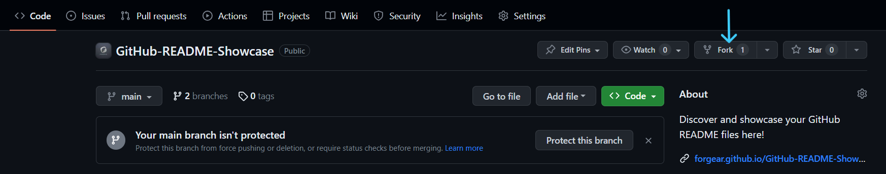
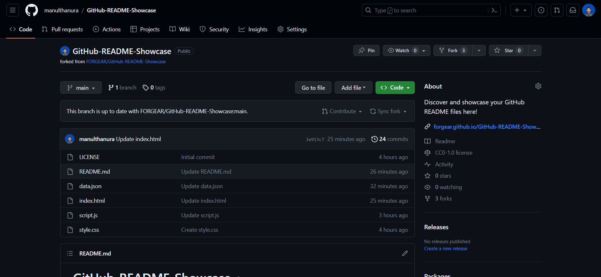
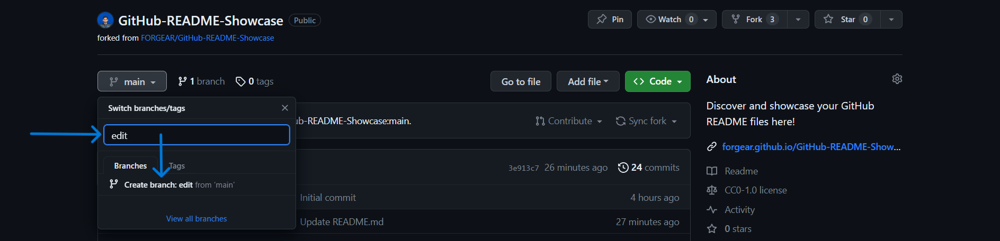
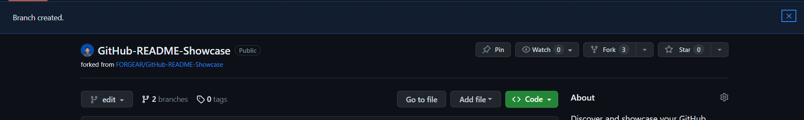
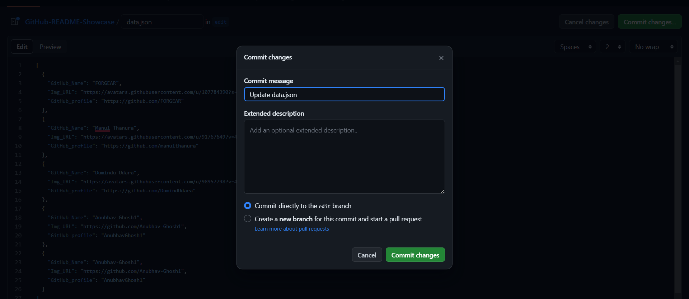
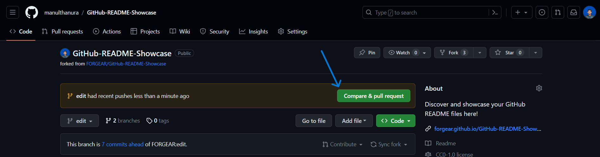
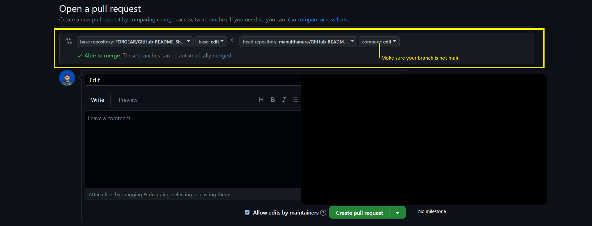

# GitHub-README-Showcase
Discover and showcase your GitHub README files here!


## How to contribute

- Submit an issue - This will let us know that you are participating in Hacktoberfest 2023. Please include your GitHub username in the issue description. Also make sure to add `manulthanura` as a assignee.
- [Fork the repository](https://github.com/FORGEAR/GitHub-README-Showcase/fork) - This will create a copy of the repository in your own GitHub account.
- Create a new branch - This will allow you to work on your changes without affecting the main repository.
- Add the README files - you want to contribute. You can do this by cloning the repository to your local machine, adding the files, and then pushing the changes to your forked repository.
- Submit a pull request - This will create a request for your changes to be merged into the main repository.
- Wait for your pull request to be reviewed - Your pull request will be reviewed by the repository owner. If there are any issues with your pull request, you will be notified via email.
- Celebrate - Your pull request has been merged into the main repository! Your changes will now be visible to everyone who visits the repository.

## What to contribute

You can contribute any GitHub profile README file that you think is creative and inspiring. It can be your own README file, or the README file of another GitHub user. Add them to the `data.json` file in the following format:

```json
  {
    "GitHub_Name": "Your GitHub username",
    "Img_URL": "The URL of your profile image",
    "GitHub_profile": "The URL of your GitHub profile",
  }
```

## How to participate in Hacktoberfest 2023

Before you can participate in Hacktoberfest 2023, you need to register on the [Hacktoberfest website](https://hacktoberfest.com). Once you have registered, you can start contributing to this repository by following the steps below.

### 01. Submit an issue

[Submit an issue](https://github.com/FORGEAR/GitHub-README-Showcase/issues/new) to this repository to let us know that you are participating in Hacktoberfest 2023. Please include `I want to contribute` as a title and your GitHub username in the issue description. Also make sure to add `manulthanura` as a assignee.

### 02. Fork this repository





### 02. Create a new branch



### 03. Add the README files

Edit the `data.json` file to add the README files that you want to contribute. You can do this by cloning the repository to your local machine, adding the files, and then pushing the changes to your forked repository.

```json
  {
    "GitHub_Name": "Your GitHub username",
    "Img_URL": "The URL of your profile image",
    "GitHub_profile": "The URL of your GitHub profile",
  }
```

Once you have added the README files, you can commit your changes and push them to your forked repository.


### 04. Create a pull request


### 05. Submit your pull request

Before submitting your pull request, please make sure that you have added a comment to the top of the README file explaining why you are contributing the file. Also make sure to add `manulthanura` as a reviewer and `Hacktoberfest` as a label.
Once you have created your pull request, you can submit it by clicking the "Create pull request" button.


### 06. Wait for your pull request to be reviewed

Your pull request will be reviewed by the repository owner. If there are any issues with your pull request, you will be notified via email.

### 07. Celebrate

Your pull request has been merged into the main repository! Your changes will now be visible to everyone who visits the repository.

## We appreciate your contributions!

Your contributions will help to make this repository a valuable resource for other GitHub users who are looking for inspiration for their own README files.

If you are contributing to this project during Hacktoberfest 2023, please make sure to follow the Hacktoberfest guidelines. This includes opening a pull request for each README file that you contribute.